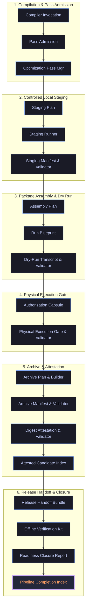

# SOL — Self-Organizing Logos

> A research engine for **meaning-centric, self-organizing AI** — part of the
> [Techman Studios](https://techmanstudios.com) research stack and the broader
> **ThothStream** reflective-AI ecosystem.

[](LICENSE)


---

## What is SOL?

**SOL (Self-Organizing Logos)** is an experimental engine that treats a concept
graph as a **coupled dynamical system** — nodes carry density, pressure, and
belief-field state; edges carry flux. 

Rather than separating storage and logic, **SOL fuses memory, routing, and computation into a single physical process**:
- **Physical Memory**: Attractor basins (DRAM-like states) and Jeans ROM collapse points (SRAM-like states) store knowledge directly as localized density and pressure configurations.
- **Autonomic Routing**: Signal wave packets carry belief fields that dynamically open and close gating channels (Psi-Transistors, MHD waveguides), routing themselves based on semantic resonance rather than fixed hardware buses.
- **In-Memory Computation**: Logic is computed physically through wave-interferometric superposition and analog threshold summation.
- **Structural Plasticity**: The network learns by physically growing new pathways (neurogenesis/synaptogenesis) in response to thought circulation density.

Out of those simple primitives we get measurable, shape-able **memory, control, and readout** behaviors:

| Pillar       | What we measure                                        |
| ------------ | ------------------------------------------------------ |
| **Memory**   | metastability, basins / attractors, retention vs leak  |
| **Control**  | belief-field bias, cadence shaping, latch primitives   |
| **Readout**  | temporal packets → structured broadcast rails (busTrace) |

SOL is the **substrate layer** of a larger reflective-AI program. It is being
developed openly in this repository while still actively evolving.

For the full conceptual write-up see **[`README_SOL.md`](README_SOL.md)**.
For the running research log see **[`SOL_Master_Chronicle.md`](SOL_Master_Chronicle.md)**.

---

## Where SOL fits — the Techman Studios stack

SOL is one component of a wider research program at **Techman Studios**
focused on reflective, self-organizing AI:

```
                ┌───────────────────────────────────────┐
                │            ThothStream                │
                │  (reflective AI substrate / mythos)   │
                └──────────────┬────────────────────────┘
                               │ provides epistemic / reflective layer
                               ▼
        ┌──────────────────────────────────────────────┐
        │                   SOL Engine                  │
        │   self-organizing semantic manifold (this)    │
        └──────────────┬───────────────────────────────┘
                       │ runtime + agents + tooling
       ┌───────────────┼─────────────────────────┐
       ▼               ▼                         ▼
   sol-cortex     sol-hippocampus           sol-rsi / self-train
   (knowledge)    (dream / consolidation)   (recursive improvement)
```

Foundational background on the reflective-AI layer lives in the **`KB/`
directory**.  That folder is user-supplied (excluded from the public repo to
protect proprietary content).  Forkers should add their own knowledge files
there and point the config at them — see [`KB/README.md`](KB/README.md) and
the minimal [`KB/sample_kb.md`](KB/sample_kb.md) template.

---

## SOL Waveguide Pipeline Architecture

The **SOL Waveguide Pipeline** is a multi-stage, deterministic verification and packaging system. It ensures that any compiled semantic manifold and its execution transcripts are fully audited, locally attested, and packaged into verified release candidates without depending on production mutations or external services.



### Component Breakdown

1. **Compilation & Pass Admission**: Admitted compiler passes are verified against structural compliance contracts (`sol_waveguide_compiler_pass_admission.py`), and memory layouts are optimized dynamically under a parameterized cost model.
2. **Controlled Local Staging**: Automatically plans, runs, and validates the output boundaries (`sol_waveguide_package_controlled_local_staging_runner.py`) using isolated directories to protect target environments from untracked modifications.
3. **Package Assembly & Dry Run**: Creates a deterministic execution blueprint (`sol_waveguide_package_assembly_run_execution_blueprint.py`) and executes a sandboxed dry-run transcript to verify command structure and parameter scaling.
4. **Physical Execution Gate**: Requires explicit operator approval using cryptographic authorization capsules (`sol_waveguide_package_assembly_run_authorization_capsule.py`) before allowing physical build steps.
5. **Archive & Attestation**: Builds and validates a clean ZIP package (`sol_waveguide_package_archive_builder.py`), then signs the archive locally via a secure digest attestation pipeline (`sol_waveguide_package_archive_digest_attestation.py`).
6. **Release Handoff & Closure**: Assembles the final handoff bundle (`sol_waveguide_release_handoff_bundle.py`), generates offline verification kits for consumers, checks readiness criteria, and seals the pipeline using the completion index.

---

## Status

SOL is **pre-1.0, actively developed research code**. Expect:

- Frequent restructuring of experiments at the repo root.
- Versioned dashboards (`sol_dashboard_v3_*.html`) kept side-by-side for audit.
- A growing **proof-packet** trail under `solKnowledge/proof_packets/` and
  raw run data under `data/`.

What is **stable enough to depend on**:

- The agent/skill scaffolding under `.github/` (instructions, prompts, agents, skills).
- The CI workflows under `.github/workflows/` (cortex, hippocampus, RSI, evolve, self-train).
- The reusable Python tooling under `tools/` (analysis, continuity, sol-core,
  sol-cortex, sol-hippocampus, sol-orchestrator, sol-rsi, sol-evolve, sol-llm).
- The test suites under `tests/`.

What is intentionally **in flux**:

- Top-level experiment scripts (`*.py` at the root) — these are working notebooks-as-scripts.
- Engine prototypes under `solEngine/` (JS phase iterations).
- HTML dashboards (a versioned audit trail, not a single canonical UI).

---

## Quick start

### Requirements

- Python **3.11+**
- A modern browser (for the HTML dashboards)
- Optional: a GitHub fine-grained PAT with **Models** access if you want to run
  the LLM-driven workflows locally.

### Install

```bash
git clone https://github.com/TechmanStudios/sol.git
cd sol
python -m venv .venv && source .venv/bin/activate   # Windows: .venv\Scripts\activate
pip install -e .
```

### Configure

```bash
cp .env.example .env
# edit .env and set GITHUB_TOKEN if you plan to use GitHub Models
```

`.env` is git-ignored — secrets stay local.

### Run the tests

```bash
pytest -m "not slow"
```

### Try a dashboard

Open any of the `sol_dashboard_v3_*.html` files directly in a browser. The
latest curated entry point is the highest-numbered file (e.g.
`sol_dashboard_v3_7_2.html`).

---

## Repository map

```
.
├── README.md                  ← you are here
├── README_SOL.md              ← full conceptual spec
├── SOL_Master_Chronicle.md    ← running research log (canonical)
├── LICENSE                    ← Apache 2.0
├── CITATION.cff               ← how to cite SOL
├── CONTRIBUTING.md            ← how to work in this repo
├── SECURITY.md                ← how to report vulnerabilities
├── CODE_OF_CONDUCT.md         ← community standards
│
├── .github/                   ← agents, skills, prompts, instructions, CI
│   ├── agents/                ← SolTech + SOL lab custom agents
│   ├── skills/                ← bundled skills (skill.md + scripts)
│   ├── prompts/               ← reusable prompt files
│   ├── instructions/          ← always-on project instructions
│   └── workflows/             ← GitHub Actions (cortex, hippocampus, RSI, …)
│
├── tools/                     ← reusable Python packages
│   ├── sol-core/              ← core engine primitives
│   ├── sol-cortex/            ← knowledge / cortex pipeline
│   ├── sol-hippocampus/       ← dream / consolidation pipeline
│   ├── sol-orchestrator/      ← workflow orchestration
│   ├── sol-rsi/               ← recursive self-improvement runner
│   ├── sol-evolve/            ← evolutionary search
│   ├── sol-llm/               ← LLM adapters
│   ├── analysis/              ← experiment ledger + metrics
│   └── continuity/            ← repo-backed memory across sessions
│
├── solEngine/                 ← JS engine prototypes (phase iterations)
├── solCompiler/               ← dashboard / research compilers
├── solResearch/               ← runbooks, master proofs, manifests
├── solKnowledge/              ← derived knowledge
│   ├── working/               ← active investigations
│   ├── consolidated/          ← curated summaries
│   └── proof_packets/         ← LEDGER + domain proof packets
├── solArchive/                ← historical artifacts
├── solData/                   ← curated data exports
├── sandBox/                   ← scratch / playground specs
├── data/                      ← raw run outputs (cortex, dream, RSI, …)
├── knowledge/                 ← source corpora (e.g. youtube transcripts)
├── KB/                        ← user-supplied knowledge bases (see KB/README.md)
├── tests/                     ← pytest suites
└── *.py / *.html              ← top-level experiments & versioned dashboards
```

---

## Automated workflows (heads-up for visitors)

This repo runs **scheduled GitHub Actions that commit research artifacts
directly to the default branch.** That is intentional — the commit log *is*
the audit trail. Expect commits authored by `sol-cortex[bot]`,
`sol-hippocampus[bot]`, `sol-evolve[bot]`, `sol-rsi[bot]`,
`sol-self-train[bot]`, `sol-orchestrator[bot]`, and `sol-intuition[bot]`.

Current cadence:

| Workflow                                  | Schedule                | What it commits                                              |
| ----------------------------------------- | ----------------------- | ------------------------------------------------------------ |
| `sol-hippocampus.yml` (dream cycle)       | Daily 04:00 UTC         | `data/dream_sessions/`, `data/memory_*`, ledger updates      |
| `sol-cortex.yml` (autonomous research)    | Weekly Mon 06:00 UTC    | `data/cortex_sessions/`, `solKnowledge/`, ledger updates     |
| `sol-pipeline.yml` (full research cycle)  | Weekly Mon 07:00 UTC    | `data/pipeline_runs/` plus the above                         |
| `sol-evolve.yml`, `sol-rsi.yml`, `sol-self-train*.yml`, `sol-intuition-learning.yml` | Manual / labeled-issue dispatch | `data/evolve_reports/`, `data/rsi/`, `data/sol_self_train_runs/github-actions/**`, golden baselines |

Safety properties relevant to a public repo:

- **No `pull_request` triggers.** Workflows never run on PRs from forks, so
  external PRs cannot exfiltrate secrets or run arbitrary code with write
  permissions.
- **Triggers are collaborator-gated** (`workflow_dispatch`, `schedule`,
  `issues: [labeled]`, `workflow_run`).
- **Scoped permissions** — workflows declare explicit `permissions:` blocks
  (`contents: write`, `issues: write`, `pull-requests: write`) rather than
  `write-all`.
- **Secrets:** only `GITHUB_TOKEN` (auto-provisioned) and `MODAL_API_KEY`
  (used by `sol-intuition-learning.yml`) are referenced. To run that workflow
  in a fork, set `MODAL_API_KEY` in your fork's repository secrets.
- **Concurrency groups + `git pull --rebase` retry** prevent races between
  scheduled runs and human commits.

If you are forking or watching this repo, expect a steady stream of automated
research commits. They are scoped to the `data/`, `solKnowledge/`, and
`tests/regression/golden/` paths and will not touch source code.

---

## How research flows here

1. A protocol or question is staged (often via a prompt file in `.github/prompts/`).
2. An experiment runner produces a **Run Bundle** under `data/`.
3. The **experiment ledger** (`tools/analysis/experiment_ledger.py`) ingests
   bundles from `self_train`, `resonance`, `rsi`, `cortex`, and `dream_sessions`
   and emits derived metrics.
4. Findings get consolidated into **proof packets** under
   `solKnowledge/proof_packets/` with a master `LEDGER.md`.
5. Nightly CI (e.g. `sol-hippocampus.yml` at 04:00 UTC) keeps the cycle running.

---

## Funding & collaboration

SOL is part of an active funding push to expand **Techman Studios'**
AI hardware and research capabilities. If you are a researcher, partner, or
funder interested in reflective / self-organizing AI substrates, please reach
out via the contact information on
[techmanstudios.com](https://techmanstudios.com) or open a GitHub Discussion.

If you cite SOL in academic or grant work, please use the metadata in
[`CITATION.cff`](CITATION.cff).

---

## Contributing

We welcome focused contributions — see **[`CONTRIBUTING.md`](CONTRIBUTING.md)**
for the workflow conventions used in this repo (small testable changes,
proof-packet discipline, agent-orchestrated development). All contributors are
expected to follow our **[Code of Conduct](CODE_OF_CONDUCT.md)**.

To report a security issue, see **[`SECURITY.md`](SECURITY.md)**.

---

## License

SOL is released under the **Apache License 2.0** — see [`LICENSE`](LICENSE).

© Techman Studios. SOL, ThothStream, and related names are project identifiers
of Techman Studios.
