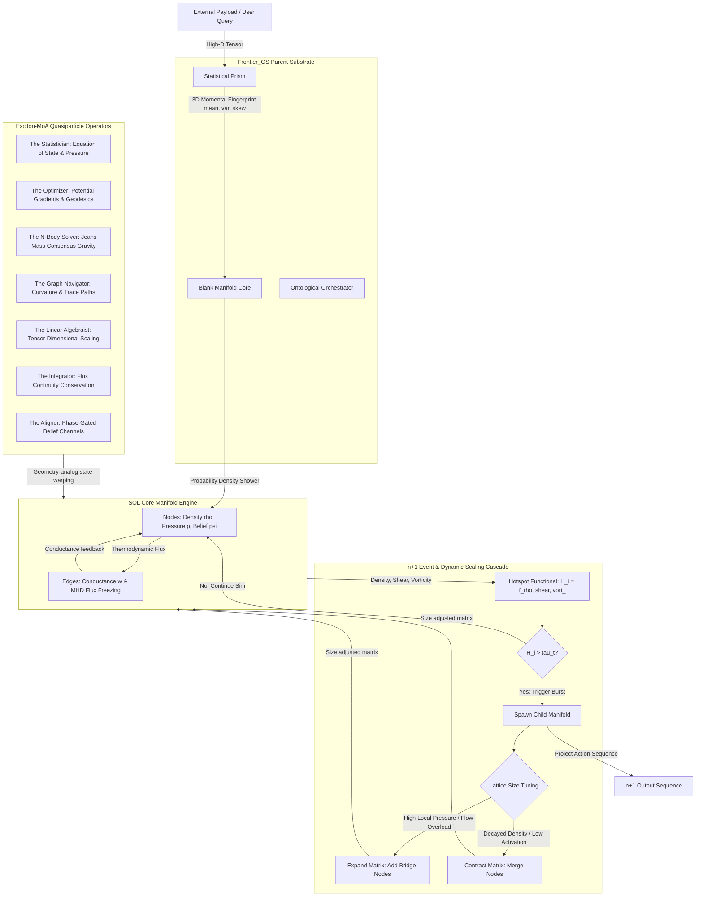

# SOL Agentic System & Frontier_OS Architecture
**Document Version:** 1.2  
**Audience:** AI Agents, System Architects, and Human Operators  

---

## 1. System Overview: The Frontier_OS Ecosystem

`Frontier_OS` is the parent operating system and repository structure designed to support non-Euclidean computational intelligence. It integrates two primary subsystems:
1. **The SOL Engine:** A stateful semantic manifold that models concepts as a coupled dynamical physical system (tracking density $\rho$, pressure $p$, and belief field $\psi$).
2. **Exciton-MoA (Mixture of Agents):** An ontological physics engine that routes agent interactions using continuous fluid dynamics and quasiparticle (Exciton) collisions, bypassing traditional linear, orchestrator-driven routing.

Instead of routing messages through a central traffic cop agent, `Frontier_OS` broadcasts data as a statistical density shower over a non-Euclidean vacuum (the **Blank Manifold**). Highly specialized mathematical operators (representing specialized agents, or "Excitons") warp the local metric tensor. Thoughts and data flow along these dynamically carved geodesics, culminating in attractor basins that trigger **n+1 Events** (Threshold Bursts) to project next-action sequences.

```
                  ┌──────────────────────────────┐
                  │          Frontier_OS         │
                  │   Parent repository environment   │
                  └──────────────┬───────────────┘
                                 │
           ┌─────────────────────┴─────────────────────┐
           ▼                                           ▼
┌──────────────────────┐                    ┌──────────────────────┐
│      SOL Engine      │                    │     Exciton-MoA      │
│  Coupled concept     │ ◄──(Wormholes)───► │ Non-Euclidean routing│
│  dynamics (ρ, p, ψ)  │                    │ of 7 Giant operators │
└──────────────────────┘                    └──────────────────────┘
```

---

## 2. Structural & Topological Components

### 2.1. The Substrate: Blank Manifold (`BlankManifoldCore`)
* **Hardware Layer:** Initializes a pristine, unweighted 1,024-node lattice in a uniform hyperbolic space ($R < 0$).
* **Role:** Serves as a topological vacuum. It contains zero baseline semantic pressure and embedding bias, offering infinite internal surface area for recursive logic loops and PCA-like dimensional reductions via gravity.

### 2.2. The Transducer: Statistical Prism (`StatisticalPrism`)
* **Role:** Translates external, high-dimensional data (e.g., 1536-D LLM embeddings) into a compressed 3D statistical fingerprint representing the data's fundamental moments (Mean, Variance, Skewness).
* **Global Resonance Broadcast (The "Shower"):** The 3D fingerprint is showered over the Blank Manifold as a continuous probability density field. Node elements phase-align with the shower simultaneously, bypassing linear index searches.

### 2.3. The Firmware: Exciton Engine (`ExcitonEngine`)
Excitons represent quasiparticles of compute. Rather than executing rigid code pipelines, the agents (the **7 Giants**) manipulate the continuous semantic state field $u(x,t) = (\rho(x,t), v(x,t), \phi(x,t))$ via differential geometry:
* **The Statistician:** Governs the equation of state ($\Pi_0(\rho)$) to manage semantic pressure and regulate overcrowding.
* **The Optimizer:** Carves potential gradients ($-\nabla_{\mathcal{M}}\phi$) to route flows toward low-error states.
* **The N-Body Solver:** Computes Jeans Mass gravity to compress density fields into consensus attractor basins.
* **The Graph Navigator:** Manages divergence-free velocity components ($w$) and negative curvature (Ricci Flow) to navigate recursive logic without stack overflows.
* **The Linear Algebraist:** Performs anisotropic tensor scaling ($L = B^{\top}W_eB$) to flatten dimensions natively.
* **The Integrator:** Adjusts the local Jacobian volume to solve continuity equations.
* **The Aligner:** Dilates/constricts node channels based on semantic phase synchronization.

### 2.4. Telemetry: Ontological Orchestrator (`OntologicalOrchestrator`)
* **Role:** Monitors the manifold using the tri-axial **Hotspot Functional** ($H_i(t)$) which measures density, potential shear, and vorticity.
* **The n+1 Event:** When a node's hotspot functional crosses the dynamically smoothed threshold $\tau_t$, it triggers a **Threshold Burst**. The orchestrator routes compute resources to the collapsing basin and projects the unrolled, machine-readable **n+1 sequence** (the subsequent sequence of thought actions) to be executed by external agents.

### 2.5. The n+1 Spawning Cascade & Dynamic Manifold Scaling
When a node's hotspot functional crosses the dynamically smoothed threshold $\tau_t$, it triggers a threshold burst. Rather than just issuing static actions, the orchestrator initiates a **Spawning Cascade** to spawn a new child manifold to isolate and process the sub-reasoning stream.

To optimize computing resources, this newly spawned manifold features **Dynamic Manifold Scaling** (Adaptive Size Modulation). Instead of initializing with a rigid, statically sized lattice (such as a fixed 64 or 1024 nodes), the child manifold dynamically grows or shrinks its active node matrix:
- **Lattice Expansion:** If local pressure gradient $\nabla p$ or flux volume $j$ exceeds threshold limits, the system injects new intermediate/bridge nodes to increase resolution and disperse load.
- **Lattice Contraction (Pruning):** When node density decays below a structural noise floor ($\rho < \rho_{floor}$), nodes are pruned, and their residual connections are merged back into parent attractor basins to conserve execution memory.



---

## 3. Entangled Manifolds & Wormhole Dynamics

To model complex, counterfactual reasoning or parallel cognitive streams, `Frontier_OS` hosts the `EntangledSOLPair` runtime, linking two SOL manifolds (A and B):

```
    [ Manifold A ]                             [ Manifold B ]
  Node_A1 (Wormhole 1)  ◄───Damped Flux j───►  Node_B1 (Wormhole 1)
  Node_A2 (Wormhole 2)  ◄───Damped Flux j───►  Node_B2 (Wormhole 2)
```

* **Wormhole Registry:** Connects designated entry and exit nodes (e.g. a registry of 12 nodes) across the two manifolds.
* **Damped Flux Exchange:** Dynamically routes flux across wormhole linkages, scaled by the `wormhole_weight_map`.
* **Coherence Feedback:** The wormhole aperture dilates (increasing flux transport) when the two manifolds are in phase ($\psi_A \approx \psi_B$) and constricts (isolating the manifolds) when they drift out of phase. This creates a double-well potential that accelerates consensus collapse.

---

## 4. The Agent Roster & Self-Improving Infrastructure

`Frontier_OS` supports a roster of agents to manage, run, and self-improve this physics-analog ecosystem:

### 4.1. Orchestration & Design
* **`SolTech-StructureManager`:** Manages repository file architecture and task execution workflows.
* **`sol-lab-master` (Pixel):** Formulates experiment protocols and ensures strict adherence to baseline rules.
* **`soltech-architect`:** Proposes structural code and configuration designs.

### 4.2. Run & Analysis
* **`sol-experiment-runner`:** Loads JSON protocols and executes simulations via the headless `sol-core` CLI.
* **`sol-data-analyst`:** Reviews output telemetry CSVs and validates conservation invariants.
* **`sol-auto-mapper`:** Automates grid sweeps across parameter groups.
* **`sol-knowledge-compiler`:** Compiles run logs into promoted, audit-ready proof packets.

### 4.3. Closed-Loop R&D (The Cortex & Evolution Stack)
* **`sol-cortex` (Autonomous Scientist):** Detects knowledge gaps, forms hypotheses, designs protocols, runs simulations, and drafts findings.
* **`sol-evolve` (Evolution Engine):** Proposes configuration parameter modifications and validates them against a regression test suite of golden checkpoints (using `mulberry32` seed 42) before submitting PRs.
* **`sol-hippocampus` (Memory Overlay):** Composites memory nodes (IDs $\ge 1000$) additively at runtime to protect default graph immutability. Periodically executes "dream cycles" to replay scored session traces, compacting them into permanent memory schemas.

---

## 5. Summary of Key Files

* `tools/sol-core/sol_engine.py`: Standalone, pure-Python headless simulation of the SOL concept manifold equations.
* `Frontier_OS/Exciton-MoA/entangled_manifolds.py`: Implements the `EntangledSOLPair` class, managing the wormhole registry, damped flux exchange, and coherence feedback loop.
* `Frontier_OS/Exciton-MoA/scripts/snowball_experiment.py`: Closed-loop runner that manages the A/B testing regime, loading `state.json` parameters and running counterfactual probes.
* `Frontier_OS/Exciton-MoA/master_equations.md`: Mathematical ledger outlining the state fields, covariant momentum, and hotspot functional equations.
* `Frontier_OS/Exciton-MoA/master_glossary.md`: Canonical definition of Exciton-MoA terminology.
