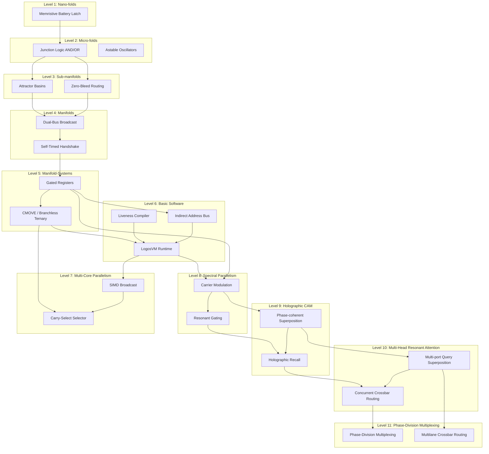

# SOL Level Architecture Specification v0.1

This document defines the architectural stack of the SOL computing system (Levels 1 through 6), detailing the physical substrates, computational primitives, promotion gates, and dependencies.

---

## 1. Stack Definition

### Level 1: Nano-folds (Physical Cell Layer)
- **Role**: State storage and local switching at the physical scale.
- **Physical Carrier**: Memristive battery latches, local state cells, and basic transistor gates.
- **Key Primitives**: Local cell state writing, holding, resetting, and reading.
- **Promotion Gate**: Can a single cell reliably store a bit, hold it under zero external excitation, reset on a trigger, and be read non-destructively?

### Level 2: Micro-folds (Local Computational Layer)
- **Role**: Localized Boolean logic gates and timing networks.
- **Physical Carrier**: Summing junction logic, local clock/oscillators, and basic ALU routing cells.
- **Key Primitives**: Physical AND/OR logic, astable oscillators, local threshold gates.
- **Promotion Gate**: Can local gates compute stable Boolean truth tables under bounded clock jitter and temperature drift?

### Level 3: Sub-manifolds (Memory and Routing Layer)
- **Role**: Insulated data storage and spatial routing networks.
- **Physical Carrier**: Multi-node attractor basins (RAM/ROM) and routing conduits.
- **Key Primitives**: Hub-and-spoke attractor stabilization, non-destructive readout, zero-bleed context routing.
- **Promotion Gate**: Can isolated memory basins store independent states without cross-talk or drift during neighboring read/write operations?

### Level 4: Manifolds (Coordinated Routing & Bus Layer)
- **Role**: Multi-port global communication and bus arbitration.
- **Physical Carrier**: Dual-bus broadcast rails, gated wormhole bridges, and handshake lines.
- **Key Primitives**: Port-to-rail broadcast, self-timed handshaking, Winner-Take-All (WTA) arbitration.
- **Promotion Gate**: Can long-range buses arbitrate concurrent broadcasts and establish stable handshakes without latchup?

### Level 5: Manifold-Systems (Orchestrated Architecture Layer)
- **Role**: Processor-memory orchestration (ALU/DRAM boundary).
- **Physical Carrier**: Processing core (blank manifolds) coupled with semantic manifolds (memory landscapes).
- **Key Primitives**: Gated register banks (A, B, C, D), mixed-signal Boolean functions, instruction decoding lines.
- **Promotion Gate**: Can semantic memory remain stable while the blank processing unit performs active computations and reads/writes registers?

### Level 6: Basic Software (Programmable Runtime Layer)
- **Role**: Substrate-aware compiler, VM, and control loop executor.
- **Physical Carrier**: Symbolic statement compiler, virtual machine call stack, indirect memory pointers.
- **Key Primitives**: CFG liveness analysis, register allocation, indirect addressing, context-switching call/return loops.
- **Promotion Gate**: Can a physical program be compiled, stored, and executed on the substrate while maintaining arithmetic correctness, memory insulation, and complete register collapse at termination?

### Level 7: Parallel Wave-Multiplexed Substrate Processing (Multi-Core Layer)
- **Role**: High-throughput SIMD parallel processing and speculative execution.
- **Physical Carrier**: Multi-core (three-lobe) register manifolds, gated wormhole select routing.
- **Key Primitives**: SIMD instruction broadcasting, speculative carry-select branching, dynamic selection multiplexing (`CMOVE` selection sequence).
- **Promotion Gate**: Can a multi-core program be executed simultaneously across parallel lobes and dynamically routed to output attractor basins without physical bleed, register interference, or mass collapse failures?

### Level 8: Spectral Parallelism (Frequency-Division Multiplexed Substrate)
- **Role**: Superimposed simultaneous calculations and frequency-selective routing.
- **Physical Carrier**: Single-core register manifold, shared ALU summing core, and parametric resonant routers.
- **Key Primitives**: Frequency-domain carrier modulation, linear wave superposition, acoustic resonant gating (phase-locked lock-in sorting).
- **Promotion Gate**: Can multiple data streams modulated at distinct carrier frequencies ($f_A$, $f_B$) coexist in a single set of registers, process simultaneously, and sort into separate output basins with active channel delta $> 0.2$ and inactive channel delta $< 0.1$, while maintaining register mass safety ($\ge 14.0$)?

### Level 9: Holographic Content-Addressable Memory (H-CAM) & Resonant Attention
- **Role**: Associative memory recall and selective focus over shared waveguide substrates.
- **Physical Carrier**: Shared waveguide bus (`P_Bus`), query broadcaster register (`S_RA`), and phase-coherent matching gates (`Gate_MatchA`, `Gate_MatchB`).
- **Key Primitives**: Holographic key encoding (carrier waves), phase-coherent wave superposition, associative recall (gated precipitation).
- **Promotion Gate**: Can multiple key-value associations ($K_A \rightarrow V_A$, $K_B \rightarrow V_B$) be stored in a shared waveguide field, and queried using frequency-and-phase-modulated query keywaves ($K_Q$) to correctly precipitate mass into matching value basins (delta $\ge 0.2$) while keeping non-matching, null, and reversed-phase channels flat (delta $< 0.1$), under register mass safety ($\ge 14.0$)?

### Level 10: Multi-Head Resonant Attention (MHRA) & Holographic Crossbar Routing
- **Role**: Concurrent multi-head query broadcasting and parallel holographic routing on a shared waveguide bus.
- **Physical Carrier**: Multi-head query registers (`S_RA`, `S_RB`), shared waveguide bus (`P_Bus`), and parallel phase-coherent matching gates (`Gate_MatchA`, `Gate_MatchB`) connecting to target value basins (`Basin_ValA`, `Basin_ValB`).
- **Key Primitives**: Simultaneous query keywave superposition (multi-port broadcast), concurrent crossbar routing (holographic de-mixing), and cross-port waveguide impedance balancing.
- **Promotion Gate**: Can concurrent query keywaves ($K_{Q,A}$, $K_{Q,B}$) be broadcast from independent register ports simultaneously onto a shared waveguide bus (`P_Bus`), and concurrently route mass to their respective target basins (`Basin_ValA`, `Basin_ValB`) with individual and parallel recall deltas $\ge 0.2$ and silent/null/phase-reversed deltas $< 0.1$, while keeping active battery register mass safe ($\ge 14.0$) across all states and ensuring clean register collapse?

### Level 11: Phase-Division Multiplexing (PDM) & Dual-Bus Crossbar (16-Bit Processing)
- **Role**: High-capacity parallel processing and 16-bit spatial routing without frequency crowding or register explosion.
- **Physical Carrier**: Two 16-bit passive register loops (`R_X`, `R_Y` running on 2 lanes each: `S_RX0`/`S_RX1` and `S_RY0`/`S_RY1`), shared 2-lane waveguide bus (`P_Bus0`, `P_Bus1`), and 16 target value basins (`Basin_Val0` to `Basin_Val15`).
- **Key Primitives**: Phase-Division Multiplexing (orthogonal sine and cosine carrier wave modulation), Spatial-Division Multiplexing (multilane waveguide routing), and parallel self-calibrating phase demultiplexing.
- **Promotion Gate**: Can a 16-bit word be modulated onto a 2-lane bus using 4 carrier frequencies with orthogonal phase offsets, broadcast concurrently, and correctly demultiplexed at 16 target value basins with active recall deltas $\ge 0.2$ and inactive/null/phase-reversed channel deltas $< 0.1$, while maintaining register mass safety ($\ge 14.0$) and clean register collapse?

---

## 2. Primitive Status Map

| Level | Primitive Name | Best Measurement Proxy | Status |
| :---: | :--- | :--- | :--- |
| **1** | Memristive Battery Latch | `b_charge`, `b_state` stability | Noise-hardened |
| **2** | Physical Gate Logic (AND/OR) | Junction $\psi$ output vs threshold | Integrated |
| **3** | Hub Attractor Basin | `rhoMaxId_t0`, modes | Sim-local robust |
| **3** | Zero-Bleed Routing | Out-of-path leakage mass = 0.0 | Sim-local robust |
| **4** | Dual-Bus Broadcast | leg-to-leg symmetry, `MASTER_busTrace` | Integrated |
| **4** | Self-Timed Handshake | Arbiter-nudge latency delay gap | Integrated |
| **5** | Gated Register Bank | battery state retention, `min_active_mass` | Integrated |
| **5** | CMOVE (Conditional Move) | Branchless destination $\psi$ state | Integrated |
| **6** | Liveness Compiler | Evacuation-spill code generation correctness | Integrated |
| **6** | VM Call Stack | Nested CALL/RET register context backup | Integrated |
| **6** | Pointer Addressing | indirect index load/store (`['C', 'D']` decoding) | Sim-local robust |
| **7** | SIMD Instruction Broadcast | Core-to-core state isolation | Noise-hardened |
| **7** | Carry-Select Multiplexing | Actual $C_4$ carry-select sum routing | Sim-local robust |
| **8** | Resonant Gating | Phase-locked lock-in mixing delta sorting | Noise-hardened |
| **8** | Carrier Modulation | Superimposed wave packet LOAD/STORE | Sim-local robust |
| **9** | Holographic Recall | precipitation delta match $\ge 0.2$ vs rejection $< 0.1$ | Noise-hardened |
| **9** | Phase-coherent Superposition | destructive rejection of reversed-phase query | Sim-local robust |
| **10** | Concurrent Crossbar Routing | simultaneous precipitation delta match $\ge 0.2$ across multiple ports | Sim-local robust |
| **10** | Multi-port Query Superposition | concurrent query broadcast onto a single shared bus without cross-port bleed | Sim-local robust |
| **11** | Phase-Division Multiplexing | orthogonal sine/cosine carrier wave superposition and demultiplexing | Sim-local robust |
| **11** | Multilane Crossbar Routing | simultaneous 16-bit routing across two physical bus lanes to 16 basins | Sim-local robust |

---

## 3. Dependency Graph

---

## 4. Promotion Gates & Verification Envelopes

### Gate 6.1: Arithmetic Family Stability
- **Required Invariants**:
  - $100\%$ arithmetic correctness across exhaustive input spaces ($512$ combinations).
  - Source memory mutation $\Delta\psi < 0.1$ and sign-invariant.
  - Registers collapse to $-1$ cleanly (mass $= 0$, battery charge $= 0$).
  - Minimum active register mass during computation window $\ge 14.0$.
  - Residual flux $< 10^{-3}$, bus mass density $< 1.0$ at termination.
- **Robustness Envelope**:
  - $dt$ integration stability drift limit ($\pm 10\%$).
  - Damping tolerance envelope ($[0.75 \times, 1.25 \times]$).
  - Timing jitter immunity ($\pm 2$ steps).

### Gate 7.1: Multi-Core Carry-Select Integration
- **Required Invariants**:
  - $100\%$ arithmetic correctness across boundary and random multi-core cases.
  - Speculative high-nibble evaluation ($S'_{4..7}$ and $S''_{4..7}$) executes concurrently with Lobe 0 sum ($S_{0..3}$).
  - Gated selection routes correct sum without sign flips in destination basins.
  - Active battery register mass during SIMD broadcast window $\ge 14.0$.
  - Residual bus density $< 1.0$ and residual routing edge flux $< 0.01$ at termination.
- **Robustness Envelope**:
  - Max 2 concurrent execution threads on the host simulation engine.
  - Integrator timestep stability cap ($dt \le 0.05$).

### Gate 8.1: Spectral Parallelism Resonant Gating
- **Required Invariants**:
  - $100\%$ demultiplexing correctness across all channel configuration states (Case 00, 10, 01, 11).
  - Active channels delta $> 0.2$ and inactive channels delta $< 0.1$ at target basins.
  - Active register mass during FDM computation window $\ge 14.0$ (measured $\ge 15.0$ at baseline 15.0).
  - Neutralized belief-bias `psi_bias = 0.0` to eliminate DC belief-gradient diode pumping.
  - Matched baseline pressure `baseline_rho = 15.0` to block DC pressure leakage while preserving mass safety.

### Gate 9.1: H-CAM Associative Recall Verification
- **Required Invariants**:
  - $100\%$ associative recall accuracy across matching, non-matching, null, and phase-reversed query keys.
  - Matching channel delta $\ge 0.2$ and non-matching/null/reversed-phase channel deltas $< 0.1$ at target value basins.
  - Active battery register mass during H-CAM computation window $\ge 14.0$ (measured $\ge 15.07$).
  - Dual-phase calibrated carrier modulation:
    - Channel A: Stored Key $f_A$ (Period 10), matching gate phase $\phi_A = 0.75\pi$, query wave phase $\phi_{in,A} = 0.5\pi$.
    - Channel B: Stored Key $f_B$ (Period 25), matching gate phase $\phi_B = 0.0$, query wave phase $\phi_{in,B} = 0.5\pi$.
    - Null keywave period: 13.0.

### Gate 10.1: Multi-Head Resonant Attention (MHRA) Parallel Recall Verification
- **Required Invariants**:
  - $100\%$ accuracy across 5 distinct query configurations: Case A (Head A active [Key A], Head B silent), Case B (Head A silent, Head B active [Key B]), Case C (Parallel Superimposed Recall [Key A + Key B]), Case D (Head A Phase-Reversed Key A, Head B silent), Case E (Both heads silent/null).
  - Matching channel deltas $\ge 0.2$ (measured $\ge 2.4$ for Case A, $\ge 11.4$ for Case B, $\ge 3.0$ and $\ge 4.1$ for Case C) and inactive/null/reversed deltas $< 0.1$ (measured negative / rejected).
  - Active battery register mass during simultaneous computation window $\ge 14.0$ (measured $\ge 15.03$).
  - Crossbar waveguide impedance balancing:
    - Channel A matching gate weight $w_{0,A} = 10.0$, matching phase $\phi_A = 0.125\pi$, query wave phase $\phi_{in,A} = 0.5\pi$.
    - Channel B matching gate weight $w_{0,B} = 2.0$, matching phase $\phi_B = 0.125\pi$, query wave phase $\phi_{in,B} = 0.5\pi$.
    - Null query period: 13.0.

### Gate 11.1: PDM & Dual-Bus Crossbar Verification
- **Required Invariants**:
  - $100\%$ accuracy across 4 distinct test cases: Case A (16-bit word recall), Case B (concurrent dual-register parallel recall), Case C (odd bit masking), Case D (phase-reversed rejection).
  - Active channels recall delta $\ge 0.2$ and inactive/null/phase-reversed channels delta $< 0.1$ at all 16 target value basins.
  - Active register mass safety during PDM computation window $\ge 14.0$ (measured $\ge 15.0$ at baseline 15.0).
  - Complete register collapse at termination.
- **Robustness Envelope**:
  - Timestep integration stability ($dt = 0.08$).
  - Self-calibrating phase suite with a 12-step 2D phase sweep to lock matching gate phases.

