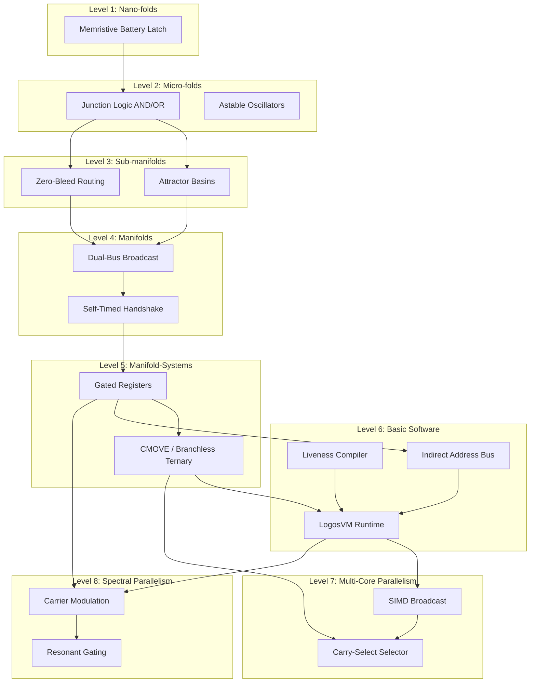

# SOL Level Architecture Specification v0.1

This document defines the architectural stack of the SOL computing system (Levels 1 through 6), detailing the physical substrates, computational primitives, promotion gates, and dependencies.

---

## 1. Stack Definition

### Level 1: Nano-folds (Physical Cell Layer)
- **Role**: State storage and local switching at the physical scale.
- **Physical Carrier**: Memristive battery latches, local state cells, and basic transistor gates.
- **Key Primitives**: Local cell state writing, holding, resetting, and reading.
- **Promotion Gate**: Can a single cell reliably store a bit, hold it under zero external excitation, reset on a trigger, and be read non-destructively?

### Level 2: Micro-folds (Local Computational Layer)
- **Role**: Localized Boolean logic gates and timing networks.
- **Physical Carrier**: Summing junction logic, local clock/oscillators, and basic ALU routing cells.
- **Key Primitives**: Physical AND/OR logic, astable oscillators, local threshold gates.
- **Promotion Gate**: Can local gates compute stable Boolean truth tables under bounded clock jitter and temperature drift?

### Level 3: Sub-manifolds (Memory and Routing Layer)
- **Role**: Insulated data storage and spatial routing networks.
- **Physical Carrier**: Multi-node attractor basins (RAM/ROM) and routing conduits.
- **Key Primitives**: Hub-and-spoke attractor stabilization, non-destructive readout, zero-bleed context routing.
- **Promotion Gate**: Can isolated memory basins store independent states without cross-talk or drift during neighboring read/write operations?

### Level 4: Manifolds (Coordinated Routing & Bus Layer)
- **Role**: Multi-port global communication and bus arbitration.
- **Physical Carrier**: Dual-bus broadcast rails, gated wormhole bridges, and handshake lines.
- **Key Primitives**: Port-to-rail broadcast, self-timed handshaking, Winner-Take-All (WTA) arbitration.
- **Promotion Gate**: Can long-range buses arbitrate concurrent broadcasts and establish stable handshakes without latchup?

### Level 5: Manifold-Systems (Orchestrated Architecture Layer)
- **Role**: Processor-memory orchestration (ALU/DRAM boundary).
- **Physical Carrier**: Processing core (blank manifolds) coupled with semantic manifolds (memory landscapes).
- **Key Primitives**: Gated register banks (A, B, C, D), mixed-signal Boolean functions, instruction decoding lines.
- **Promotion Gate**: Can semantic memory remain stable while the blank processing unit performs active computations and reads/writes registers?

### Level 6: Basic Software (Programmable Runtime Layer)
- **Role**: Substrate-aware compiler, VM, and control loop executor.
- **Physical Carrier**: Symbolic statement compiler, virtual machine call stack, indirect memory pointers.
- **Key Primitives**: CFG liveness analysis, register allocation, indirect addressing, context-switching call/return loops.
- **Promotion Gate**: Can a physical program be compiled, stored, and executed on the substrate while maintaining arithmetic correctness, memory insulation, and complete register collapse at termination?

### Level 7: Parallel Wave-Multiplexed Substrate Processing (Multi-Core Layer)
- **Role**: High-throughput SIMD parallel processing and speculative execution.
- **Physical Carrier**: Multi-core (three-lobe) register manifolds, gated wormhole select routing.
- **Key Primitives**: SIMD instruction broadcasting, speculative carry-select branching, dynamic selection multiplexing (`CMOVE` selection sequence).
- **Promotion Gate**: Can a multi-core program be executed simultaneously across parallel lobes and dynamically routed to output attractor basins without physical bleed, register interference, or mass collapse failures?

### Level 8: Spectral Parallelism (Frequency-Division Multiplexed Substrate)
- **Role**: Superimposed simultaneous calculations and frequency-selective routing.
- **Physical Carrier**: Single-core register manifold, shared ALU summing core, and parametric resonant routers.
- **Key Primitives**: Frequency-domain carrier modulation, linear wave superposition, acoustic resonant gating (phase-locked lock-in sorting).
- **Promotion Gate**: Can multiple data streams modulated at distinct carrier frequencies ($f_A$, $f_B$) coexist in a single set of registers, process simultaneously, and sort into separate output basins with active channel delta $> 0.2$ and inactive channel delta $< 0.1$, while maintaining register mass safety ($\ge 14.0$)?

---

## 2. Primitive Status Map

| Level | Primitive Name | Best Measurement Proxy | Status |
| :---: | :--- | :--- | :--- |
| **1** | Memristive Battery Latch | `b_charge`, `b_state` stability | Noise-hardened |
| **2** | Physical Gate Logic (AND/OR) | Junction $\psi$ output vs threshold | Integrated |
| **3** | Hub Attractor Basin | `rhoMaxId_t0`, modes | Sim-local robust |
| **3** | Zero-Bleed Routing | Out-of-path leakage mass = 0.0 | Sim-local robust |
| **4** | Dual-Bus Broadcast | leg-to-leg symmetry, `MASTER_busTrace` | Integrated |
| **4** | Self-Timed Handshake | Arbiter-nudge latency delay gap | Integrated |
| **5** | Gated Register Bank | battery state retention, `min_active_mass` | Integrated |
| **5** | CMOVE (Conditional Move) | Branchless destination $\psi$ state | Integrated |
| **6** | Liveness Compiler | Evacuation-spill code generation correctness | Integrated |
| **6** | VM Call Stack | Nested CALL/RET register context backup | Integrated |
| **6** | Pointer Addressing | indirect index load/store (`['C', 'D']` decoding) | Sim-local robust |
| **7** | SIMD Instruction Broadcast | Core-to-core state isolation | Noise-hardened |
| **7** | Carry-Select Multiplexing | Actual $C_4$ carry-select sum routing | Sim-local robust |
| **8** | Resonant Gating | Phase-locked lock-in mixing delta sorting | Noise-hardened |
| **8** | Carrier Modulation | Superimposed wave packet LOAD/STORE | Sim-local robust |

---

## 3. Dependency Graph

---

## 4. Promotion Gates & Verification Envelopes

### Gate 6.1: Arithmetic Family Stability
- **Required Invariants**:
  - $100\%$ arithmetic correctness across exhaustive input spaces ($512$ combinations).
  - Source memory mutation $\Delta\psi < 0.1$ and sign-invariant.
  - Registers collapse to $-1$ cleanly (mass $= 0$, battery charge $= 0$).
  - Minimum active register mass during computation window $\ge 14.0$.
  - Residual flux $< 10^{-3}$, bus mass density $< 1.0$ at termination.
- **Robustness Envelope**:
  - $dt$ integration stability drift limit ($\pm 10\%$).
  - Damping tolerance envelope ($[0.75 \times, 1.25 \times]$).
  - Timing jitter immunity ($\pm 2$ steps).

### Gate 7.1: Multi-Core Carry-Select Integration
- **Required Invariants**:
  - $100\%$ arithmetic correctness across boundary and random multi-core cases.
  - Speculative high-nibble evaluation ($S'_{4..7}$ and $S''_{4..7}$) executes concurrently with Lobe 0 sum ($S_{0..3}$).
  - Gated selection routes correct sum without sign flips in destination basins.
  - Active battery register mass during SIMD broadcast window $\ge 14.0$.
  - Residual bus density $< 1.0$ and residual routing edge flux $< 0.01$ at termination.
- **Robustness Envelope**:
  - Max 2 concurrent execution threads on the host simulation engine.
  - Integrator timestep stability cap ($dt \le 0.05$).

### Gate 8.1: Spectral Parallelism Resonant Gating
- **Required Invariants**:
  - $100\%$ demultiplexing correctness across all channel configuration states (Case 00, 10, 01, 11).
  - Active channels delta $> 0.2$ and inactive channels delta $< 0.1$ at target basins.
  - Active register mass during FDM computation window $\ge 14.0$ (measured $\ge 15.0$ at baseline 15.0).
  - Neutralized belief-bias `psi_bias = 0.0` to eliminate DC belief-gradient diode pumping.
  - Matched baseline pressure `baseline_rho = 15.0` to block DC pressure leakage while preserving mass safety.

