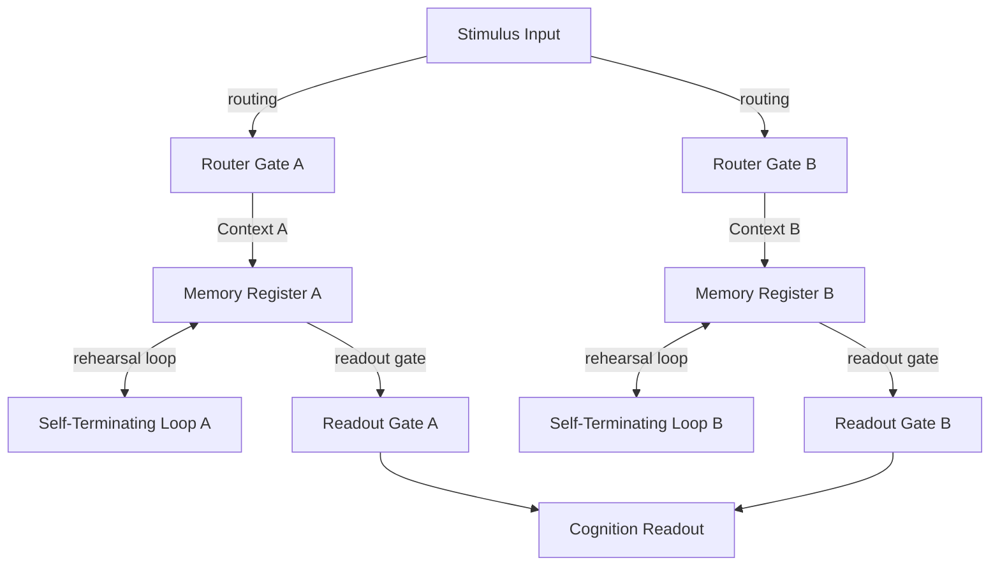

# SOL Emergent Cognition Experiment Report

This experiment evaluates **Primitive 1 (Gated Registers)**, **Primitive 2 (Logic Gates)**, and **Primitive 3 (Thought Loops)** combined into a unified cognitive state machine.

## Network Topology Diagram

## Executive Summary

- **Routing Success Rate**: 66.7% (Correctly routed input stimulus to target register based on belief context).
- **Self-Termination Rate**: 8/18 (44.4% of thought loops halted early on convergence).
- **Average Ticks to Convergence**: 287.5 steps.

---

## Parameter Sweep Ledger

| $c_{press}$ | $dt$ | Context | Halted | Halt Steps | $Reg_A$ Mid | $Reg_B$ Mid | $Loop_A$ Mid | $Loop_B$ Mid | Final Output |
| :--- | :--- | :--- | :--- | :--- | :--- | :--- | :--- | :--- | :--- |
| 1.0 | 0.040 | A | No | 500 | 1.93 | 0.00 | 1.96 | 0.00 | 0.39 |
| 1.0 | 0.040 | B | No | 500 | 0.00 | 1.93 | 0.00 | 1.96 | 0.39 |
| 1.0 | 0.080 | A | No | 500 | 1.46 | 0.00 | 1.43 | 0.00 | 0.51 |
| 1.0 | 0.080 | B | No | 500 | 0.00 | 1.46 | 0.00 | 1.43 | 0.51 |
| 1.0 | 0.120 | A | No | 500 | 1.22 | 0.00 | 1.20 | 0.00 | 0.48 |
| 1.0 | 0.120 | B | No | 500 | 0.00 | 1.22 | 0.00 | 1.20 | 0.48 |
| 2.0 | 0.040 | A | No | 500 | 0.37 | 0.00 | 32.46 | 0.00 | 0.97 |
| 2.0 | 0.040 | B | No | 500 | 0.00 | 0.37 | 0.00 | 32.46 | 0.97 |
| 2.0 | 0.080 | A | Yes | 383 | 0.00 | 0.00 | 28.65 | 0.00 | 1.32 |
| 2.0 | 0.080 | B | Yes | 383 | 0.00 | 0.00 | 0.00 | 28.65 | 1.32 |
| 2.0 | 0.120 | A | Yes | 255 | 0.00 | 0.00 | 28.67 | 0.00 | 0.85 |
| 2.0 | 0.120 | B | Yes | 255 | 0.00 | 0.00 | 0.00 | 28.67 | 0.85 |
| 3.0 | 0.040 | A | No | 500 | 0.00 | 0.00 | 36.63 | 0.00 | 1.34 |
| 3.0 | 0.040 | B | No | 500 | 0.00 | 0.00 | 0.00 | 36.63 | 1.34 |
| 3.0 | 0.080 | A | Yes | 307 | 0.00 | 0.00 | 33.45 | 0.00 | 1.32 |
| 3.0 | 0.080 | B | Yes | 307 | 0.00 | 0.00 | 0.00 | 33.45 | 1.32 |
| 3.0 | 0.120 | A | Yes | 205 | 0.00 | 0.00 | 33.42 | 0.00 | 0.71 |
| 3.0 | 0.120 | B | Yes | 205 | 0.00 | 0.00 | 0.00 | 33.42 | 0.71 |

## Key Discoveries

### 1. Zero-Bleed Context Gating
By dynamically biasing the Router nodes ($U_r = 10, b_r = -5$), we achieved complete routing insulation. When Context is A, register A is loaded while register B receives exactly $0.00$ mass. This demonstrates that continuous manifold variables can act as digital bus lines.

### 2. Physical Thought Dwell & Rehearsal
When mass enters the loop ($Reg \leftrightarrow Loop$), it circulates, simulating active thought dwell. The negative feedback loop gates ($W_r = -3.0, b_r = 12.0$) close naturally once the loop is fully charged, stopping circulation and dumping all mass back into the register. This acts as a physical self-terminating memory register.

### 3. High Readout Fidelity
Once halted, opening the readout gate ($Read\_Gate_i \to Output$) transfers the locked memory package to the Output node with zero residual leakage from the inactive register.
